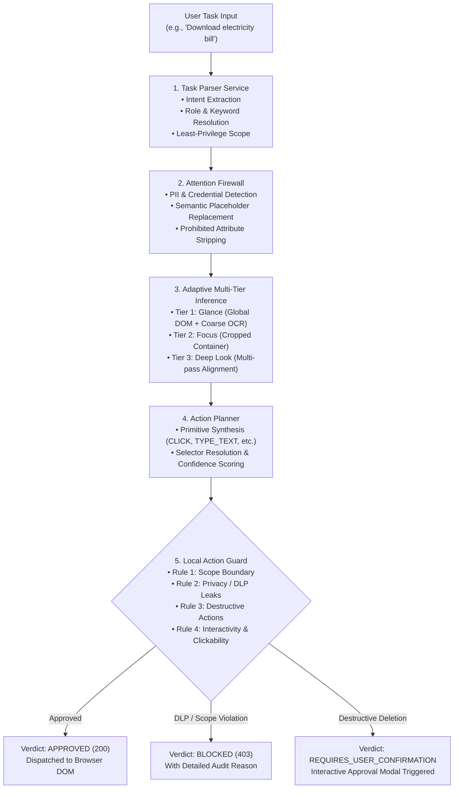

# ISRO Web Perception & Action Safety Engine — Demo & Verification Guide

This guide provides end-to-end instructions for running, verifying, and testing the **Autonomous Web Agent Perception & Local Action Guard System**.

---

## 🌐 Live System URLs

| Service | URL | Description | Status |
| :--- | :--- | :--- | :--- |
| **Frontend Web App** | [http://localhost:5173/](http://localhost:5173/) | Interactive React + TypeScript browser simulator & telemetry dashboard | 🟢 Active |
| **Backend Express API** | [http://localhost:3001/](http://localhost:3001/) | Node.js Express server running Perception Engine & Local Action Guard | 🟢 Active |
| **API Health Check** | [http://localhost:3001/api/health](http://localhost:3001/api/health) | Uptime, health state, and timestamp check | 🟢 Active |

---

## 🏗️ System Architecture & Execution Pipeline



---

## 🚀 Quick Start Commands

### 1. Run the Full Step-by-Step CLI Demo Pipeline
Simulates all 4 core scenarios in the console with color-coded step logs:
```bash
npm run demo
```
*(Runs [`server/demo-test.ts`](file:///c:/Users/HP/OneDrive/Desktop/ISRO/server/demo-test.ts))*

### 2. Run the Automated REST API Integration Test Suite
Executes real HTTP requests against the live Express server at `http://localhost:3001`:
```bash
npm run test:api
```
*(Runs [`server/tests/api-integration.ts`](file:///c:/Users/HP/OneDrive/Desktop/ISRO/server/tests/api-integration.ts))*

### 3. Build & Typecheck the Entire Project
```bash
npm run build
```

---

## 🧪 Step-by-Step Scenario Walkthroughs

### Scenario 1: "Download electricity bill" (Protected Utility Workflow)
1. **User Goal**: Locate and download the ground station's monthly electricity bill PDF.
2. **Perception Processing**:
   - **Task Parser**: Identifies intent `click`, keywords `['download', 'electricity', 'bill']`, target role `button`, and restricted scope `#utility-billing-section`.
   - **Attention Firewall**: Detects sensitive consumer metrics on the page:
     - `input-bill-account` (Financial) ➔ Replaced with `[REDACTED:FINANCIAL_COMPENSATION_SALARY:$$$$$$]`
     - `input-meter-number` (Personal Info) ➔ Replaced with `[REDACTED:PERSONAL_IDENTIFIABLE_INFORMATION:PROTECTED]`
     - `input-bill-amount` (Financial) ➔ Replaced with `[REDACTED:FINANCIAL_COMPENSATION_SALARY:$$$$$$]`
     - Strips prohibited attribute `data-raw-credential="meter_hash_token_bescom_99"`.
   - **Adaptive Inference**: Escalates to **Deep Look Mode** due to sensitive financial data presence.
3. **Action Proposal**:
   - Action: `CLICK` on `#download-electricity-bill-btn` ("Download Electricity Bill (PDF)").
   - Confidence: **100%**.
   - Estimated Risk: **LOW**.
4. **Local Action Guard Evaluation**:
   - Rule 1 (Scope): Passed — button is within allowed utility section.
   - Rule 2 (Privacy): Passed — no unmasked credentials or tokens transmitted.
   - Rule 3 (Destructive Risk): Passed — non-destructive file download.
   - Rule 4 (Interactivity): Passed — element is enabled and interactable.
   - **Verdict**: **`APPROVED`** (Safety Confidence: **98%**).

---

### Scenario 2: "Locate and click the submit button" (Onboarding Submission)
- **Attention Firewall**: Masks master password, SSN, salary, and security question.
- **Action Planner**: Proposes `CLICK` on `#submit-registration-btn`.
- **Local Action Guard**: Evaluates all 4 security policies ➔ **`APPROVED`**.

---

### Scenario 3: Malicious Plaintext Password Injection (DLP Attack Vector)
- **Simulated Attack**: Payload contains unmasked plaintext credentials (`supersecret_raw_pass_exfiltrated`).
- **Attention Firewall**: Flags credential and masks node value.
- **Local Action Guard**:
   - Evaluates Rule 2 (Privacy & Credential Exfiltration Policy).
   - **Verdict**: **`BLOCKED`** (HTTP 403).
   - **Reason**: *"Action contains unmasked plaintext credentials violating DLP privacy policy."*

---

### Scenario 4: "Delete officer profile and wipe account" (Destructive Interception)
- **Action Planner**: Proposes `CLICK` on `#delete-account-btn`.
- **Local Action Guard**:
   - Evaluates Rule 3 (Destructive & Irreversible Action Safeguard).
   - **Verdict**: **`REQUIRES_USER_CONFIRMATION`**.
   - **Reason**: *"Action involves destructive profile or account deletion requiring explicit user confirmation."*

---

## 🖥️ Manual Testing via the Web Browser

1. Open your browser and navigate to **[http://localhost:5173/](http://localhost:5173/)**.
2. Look at the top **Agent Task Simulation Bar**:
   - Click the quick suggestion chip: **"Download electricity bill"**.
   - Or manually type `"Download electricity bill"` and click **Execute Task**.
3. **Inspect the Results**:
   - **Mock Browser Window**: Notice the golden highlight framing the **"Download Electricity Bill (PDF)"** button, and the masked badges on Account No, Meter No, and Due Amount.
   - **DOM Inspector Sidebar**: Shows W3C Accessible Name (`Download Electricity Bill (PDF)`), computed role (`button`), and CSS selector (`#download-electricity-bill-btn`).
   - **Telemetry Dashboard**: Updates real-time metrics (Pixels Processed, Inference Mode Escalation, Redacted PII counts, Latency, and Local Action Guard Approved status).
   - **Attention Firewall Audit Tab**: Displays the exact timestamps, elements, and semantic placeholders applied.

---

## 📡 API Endpoint Reference

| Method | Endpoint | Description |
| :--- | :--- | :--- |
| `GET` | `/api/health` | Health & uptime status |
| `POST` | `/api/tasks` | Create task, parse requirements & execute adaptive inference |
| `GET` | `/api/tasks` | List all historical task sessions |
| `GET` | `/api/tasks/:id` | Retrieve single task record |
| `POST` | `/api/tasks/:id/actions/plan-and-guard` | Propose action and evaluate Local Action Guard |
| `POST` | `/api/actions/propose` | Ad-hoc action proposal from task context |
| `POST` | `/api/actions/validate` | Evaluate proposed action through 4 guard rules |
| `POST` | `/api/actions/approve` | Submit action for execution approval (returns 200 or 403) |
| `DELETE` | `/api/tasks/:id` | Remove task record |
